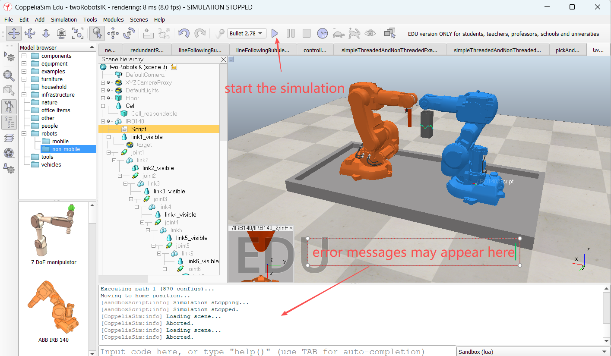

# Week 1: CoppeliaSim Setup

---------------
#### :dizzy: **Date :** Jan 16
#### :alarm_clock: Week 1 will not be counted into grade. Students can finish it after class.

------------------
## 1. Installation
- [ ] Download and install https://www.coppeliarobotics.com/  .

  Select the edu version

- [ ] Once installed, open the CoppeliaSim,

  On the top bar, select ""Open Scene". It contains many example .ttt scene files.

  You can open anyone.

  For example, open "kinematics folder -> twoRobotsIK.ttt"

- [ ] Run the scene to execute the simulation.
  
  On Bottom of the CoppeliaSim main window, you can see a "Console".

  There should be no error in Console.

    
  

## 2. Bind Python to CoppeliaSim
- [ ] - [ ] - [ ] 

🎉 **No Check Point**. Make sure you finish the tasks.

-------------------

---
