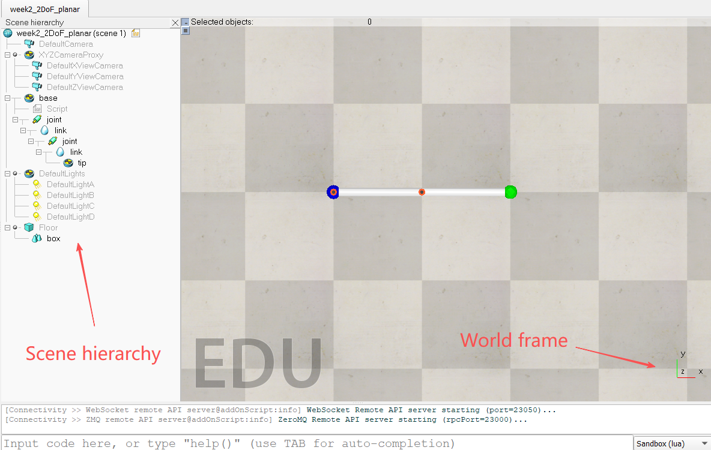
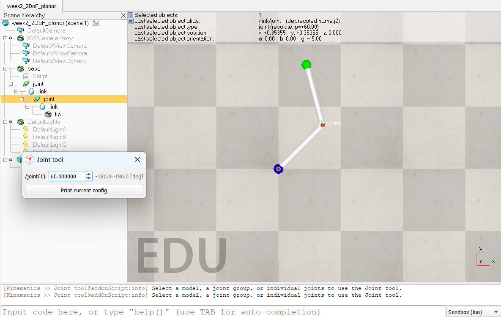
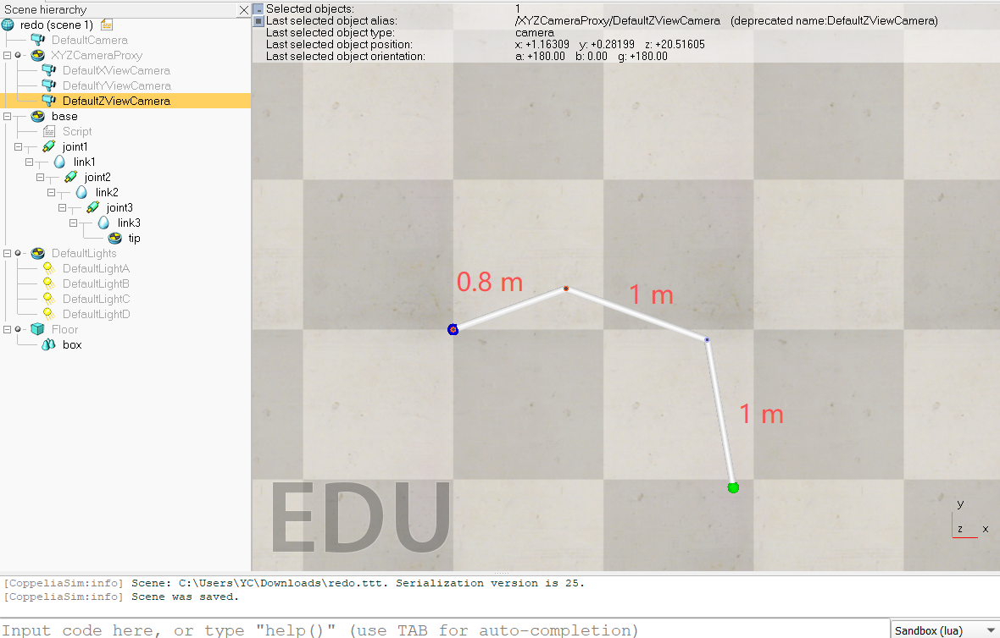

# Week 2: Forward Kinematics 2D

---------------
#### :dizzy: **Date :** Jan 23
#### :alarm_clock: Finish Check Points and Submit sheet to obtain grade.

------------------
## 1. Two-DOF planar manipulator

- [ ] Download the  provided ``Asset/week2_2DoF_planar.ttt`` scene file. 

- [ ] Open the file in CoppeliaSim. You will see a two-DOF planar manipulator.
 For this manipulator, both links have a **length of 0.5 m.**

- [ ] In the Scene hierarchy (left panel), observe the joint–link structure of the robot.

- [ ] The world frame is displayed in the corner of the scene view: the X-axis points to the right, the Y-axis points upward, the 
Z-axis is perpendicular to the 2D plane.

- [ ] If you want to zoom in/out, you can select Scene hierarchy -> DefaultZViewCamera, change the value in ``ortho. size [m]``; If you want to move the scene up/down/left/right, hold the middle mouse button and drag the mouse.

    

- [ ] Try to use "Joint tool" to rorate the two joints. To do so:  click one joint in Scene hierarchy, then go to "Modules -> Kinematics -> Joint tool", it will pop out a small window showing angle adjustment.  Feel free to play with any angles for the given two joints.

    

- [ ] After rotating the joints, the final position of the end-effector can be viewed by:  click the "tip" in Scene hierarchy, then the `x: ..., y: ..., z:...` info will be displayed on top of the scene view.

### :page_facing_up: Task to complete:
- [ ] Use the given rotating angles in the worksheet. Do:
      
  * **Analytical calculation**
Using the forward kinematics derived in lecture, write out the linear algebra calculation steps in the provided worksheet. Clearly show how the joint angles are used to compute the end-effector position.

  * **Simulation verification**
Apply the given joint angles in CoppeliaSim by rotating the joints. Write down the simulated end-effector ("Tip") position in the provided worksheet.

------------------
## 2. Three-DOF planar manipulator

- [ ] Download the  provided ``Asset/week2_3DoF_planar.ttt`` scene file. 

- [ ] Follow the same procedures as the last task.
 For this manipulator, link lengths are:
* link1: 0.8 m
* link2: 1 m
* link3: 1 m

    
  
