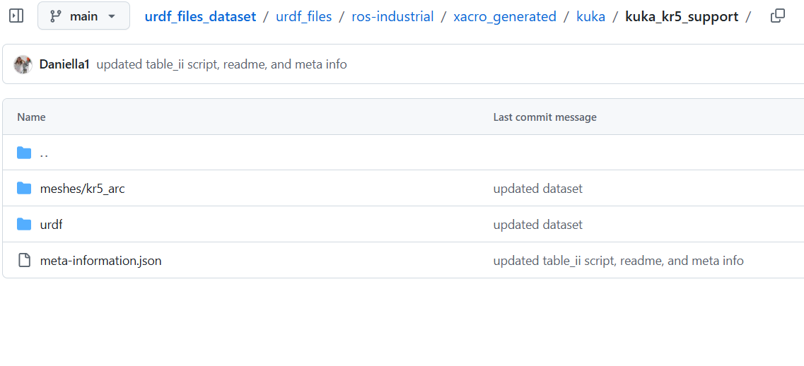
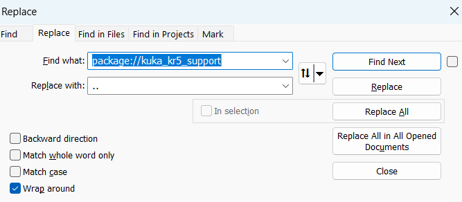
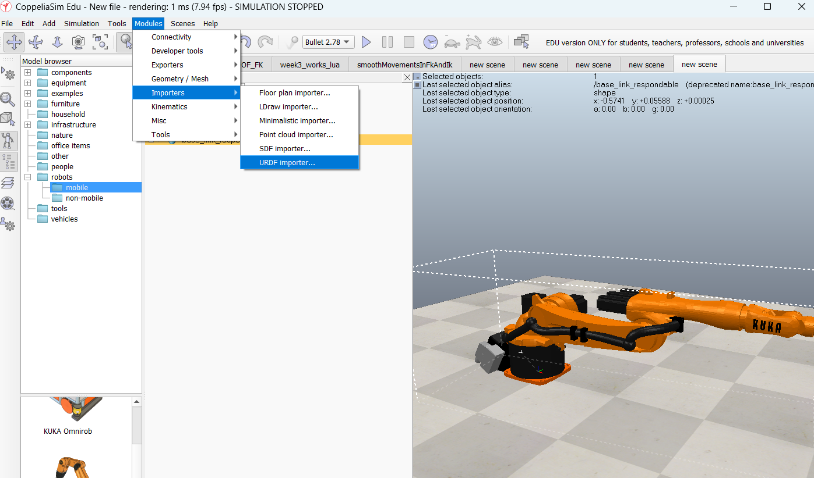

# Week 4: URDF

---------------
#### :dizzy: **Date :** Feb 6
#### :alarm_clock: Finish Check Points and Submit sheet to obtain grade.


------------------
## 1. Load a URDF to CoppeliaSim

* [ ] Go to the URDF dataset repo: [https://github.com/Daniella1/urdf_files_dataset](https://github.com/Daniella1/urdf_files_dataset)
  This repo contains URDF files for many different robots.

* [ ] Find the **folder that corresponds to the robot assigned in your Worksheet - Task 1**.

* [ ] Download the URDF files using **one** of the options below:

  **Option 1 — Download the full repository**

  * [ ] Download/clone the entire GitHub repo (unzip ~1.7 GB). Then delete all after class to free storage.

  **Option 2 — Download only your robot folder**

  * [ ] Manually download the URDF + any related files inside your robot’s folder (such as `.stl`, `.dae`).

-------
Here, I use a KR 5 ARC robot as an example to explain:

* [ ] Find the robot URDF in the dataset repo.
* [ ] Navigate to its upper level folder. You should see: One URDF (.urdf) folder; One mesh folder. You should get all files in these 2 folders.



* [ ] Most URDF files are originally designed for ROS. When using the URDF in other simulators (e.g., CoppeliaSim), some file paths inside the URDF may not work correctly.
<br> For example, in my example https://github.com/Daniella1/urdf_files_dataset/blob/main/urdf_files/ros-industrial/xacro_generated/kuka/kuka_kr5_support/urdf/kr5_arc.urdf 
<br> You can see file path such as 
<br> ```<mesh filename="package://kuka_kr5_support/meshes/kr5_arc/visual/base_link.dae"/>```
<br> ```<mesh filename="package://kuka_kr5_support/meshes/kr5_arc/collision/base_link.stl"/>```
<br> ```<mesh filename="package://kuka_kr5_support/meshes/..."/>``` 
<br> You need to modify all these to be your location file location.
<br> For example, I download the full repo. Folder structure will look like this:
```
kuka_kr5_support/
 ├── urdf/
 │    └── kr5_arc.urdf
 └── meshes/
      └── kr5_arc/
           ├── visual/
           │    ├── base_link.dae
           │    └── ...
           └── collision/
                ├── base_link.stl
                └── ...
```
* [ ] Thus, I open the ```kr5_arc.urdf``` (use any text editor or code IDE). Replace all as such:
<br> ```<mesh filename="../meshes/kr5_arc/visual/base_link.dae"/>```
<br> ```<mesh filename="../meshes/kr5_arc/collision/base_link.stl"/>```
<br> ```<mesh filename="../meshes/..."/>``` 



* [ ] Once done, save it. Then go to CopperliaSim, Open a new scene.
* [ ] Go to "Modules -> Importers -> URDF Importer". Use the default import setting.
* [ ] You should see the robot in the simulator now!




### :page_facing_up: Task to complete:
- [ ]  Load the required robot URDF based on the Worksheet
     
  * Save the CoppeliaSim scene for check. It will be checked when you submit the Worksheet.

  * Write down the (x, y, z) position of the end effector in the default configuration.

  * Write down the (x, y, z) position of the end effector when you rotate the first joint by 90 deg (nearest to base).

---

## 2. PUMA URDF & Forward Kinematics

The **Unimation PUMA** is a classic industrial robot that has been widely used in robotics textbooks for decades.

* [ ] Start a **new scene** in your simulator.
* [ ] Follow the same procedure as Section 1 to download and load the **PUMA 560** URDF to CoppeliaSim.

      
* [ ] The DH parameters of the PUMA 560 robot are

| Joint |  a (m) |  d (m)  |  α (rad) |
| ----: | :----: | :-----: | :------: |
|     1 |    0   |  0.6718 | +π/2 |
|     2 | 0.4318 |    0    |     0    |
|     3 | 0.0203 | 0.15005 | -π/2 |
|     4 |    0   |  0.4318 | +π/2|
|     5 |    0   |    0    | -π/2 |
|     6 |    0   |    0    |     0    |

    
### :page_facing_up: Task to complete:
- [ ] Use the given rotating angles in the worksheet. Do:

  * **Python calculation**
Use Python code to calculate the end-effector position of PUMA 560. Write down the Python calculated position in the provided worksheet. 

  * **Simulation verification**
Apply the given joint angles in CoppeliaSim by rotating the joints. Write down the simulated end-effector position in the provided worksheet. 


> [!NOTE]
> The Python code is partially provided as follows.

```python
import numpy as np

def get_standard_dh_matrix(a, alpha, d, theta):
    return np.array([
        [??, ??,  ??, ??],
        [??,  np.cos(theta)*np.cos(alpha), -np.cos(theta)*np.sin(alpha), a*np.sin(theta)],
        [??,              np.sin(alpha),               np.cos(alpha),              d],
        [0,              0,                           0,                          1]
    ])

def calculate_fk_standard(joint_angles_deg):
    q = np.radians(joint_angles_deg)
    
    # Standard DH Table
    # [a, alpha, d, theta]
    dhparams = [
        (0,       np.pi/2,  0.6718,  q[0]), 
        (0.4318,  0,        0,       q[1]), 
        (??, ??,  ??, np.pi - q[2]),
        (??, ??,  ??, q[3]), 
        (??, ??,  ??, q[4]),
        (0,       0,        0,       q[5]) 
    ]

    T_total = np.eye(4)
    for a, alpha, d, theta in dhparams:
        T_total = T_total @ get_standard_dh_matrix(a, alpha, d, theta)
        
    return T_total[:3, 3]

# Set your joints in deg
my_joints = [0, 0, 135, 0, 0, 0] 
pos = calculate_fk_standard(my_joints)

print(f"End-effector Position at {my_joints}:")
print(f"X: {pos[0]:.4f} m")
print(f"Y: {pos[1]:.4f} m")
print(f"Z: {pos[2]:.4f} m")
```
