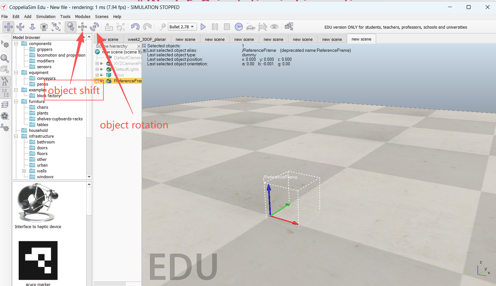
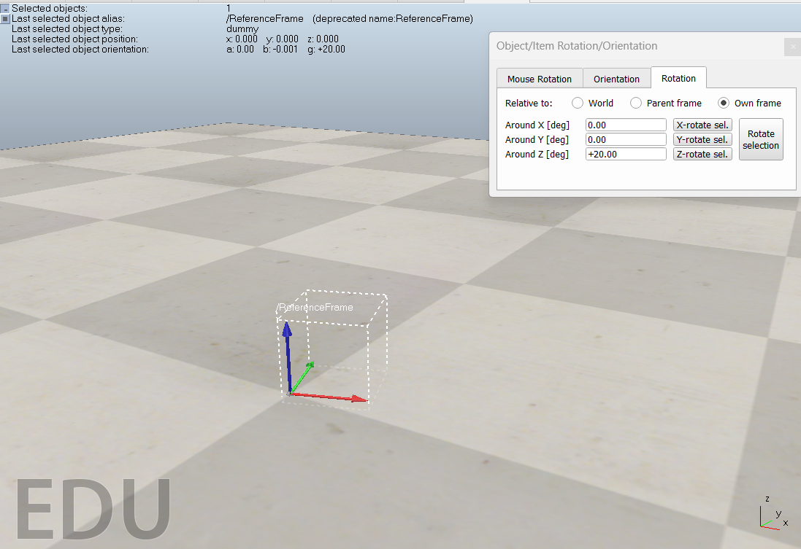
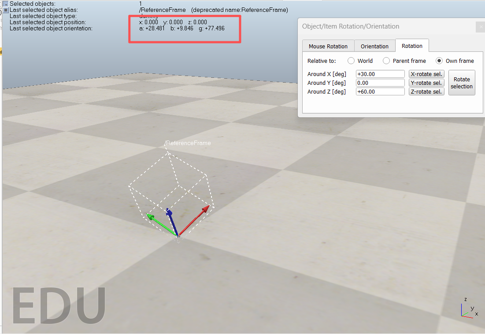
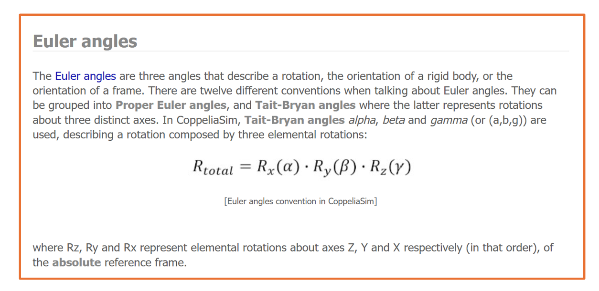

# Week 5: Orientation in kinematics

---------------
#### :dizzy: **Date :** Feb 13
#### :alarm_clock: Finish Check Points and Submit sheet to obtain grade.

------------------
## 1. Visualize a Frame in CoppeliaSim

- [ ] Open a new scene in CoppeliaSim

- [ ] From the left-side "Model Browser", go to "Others" folder, select "Reference frame"

- [ ] Drag and place the "Reference frame" into the new scene

- [ ] Set the item at world origin and align with world frame (x-y-z frame in bottom right corner). To do so, we need to:

 * Go to "Object Shift", In "Position" → "Relative to World", set all X, Y, Z to be 0
 * Go to "Object Rotation", In "Orientation" → "Relative to World", set all Alpha, Beta, Gamma to be 0

- [ ] Once done, you should get the same looking as this picture
      

------------------
## 2. Rotate a Frame in CoppeliaSim

Next, we will perform Euler-angle rotation to this reference frame. 
 Specifically, we will perform **System I Euler-angle rotation (or called z-x′-z″)**
 We are about to rotate in this sequence: 
* 20 deg about the OZ axis (or called z axis)
* 30 deg about the rotated OU axis (or called x' axis)
* 60 deg about the rotated OW axis (or called z'' axis)

- [ ] Go to "Object Rotation", In "Rotation", firstly set to "Relative to own frame"
- [ ] Firsly, set "Around Z [deg]" as 20, click "Z-rotate sel.". You should can the frame rotates following the right-hand rule.

- [ ] Secondly, set "Around X [deg]" as 30, click "X-rotate sel.". You should can the frame rotates again.
- [ ] Thirdly, set "Around Z [deg]" as 60, click "Z-rotate sel.". You should can the frame rotates again.
- [ ] At the end, you should get such looking, and also get a reading of `α: +28.xxx deg; β: +9.xxx deg; γ: +77.xxx deg` on screen

- [ ] The reading of `α: +28.xxx deg; β: +9.xxx deg; γ: +77.xxx deg` is another represtation convention of Euler Angle. It is based on **roll, pitch and yaw" (RPY)**, but in a different sequence as the common one in our slides.  What CoppeliaSim used in actually **"yaw, pitch, roll"** sequence.
- [ ] You can find detailed reference on their manual https://manual.coppeliarobotics.com/en/positionOrientationTransformation.htm
  

---

## 3. Verification via Python Calculation

We would like to verify whether the following two representations describe the same rotation:

* The rotation we applied using **System I Euler angles (z–x′–z″)**:
  ( 20 deg → 30 deg → 60 deg )

* The orientation reported by CoppeliaSim in **yaw, pitch, roll** format:
  ( α = +28.xxx deg,; β = +9.xxx deg,; γ = +77.xxx deg )

* Read ana complete the Python code
