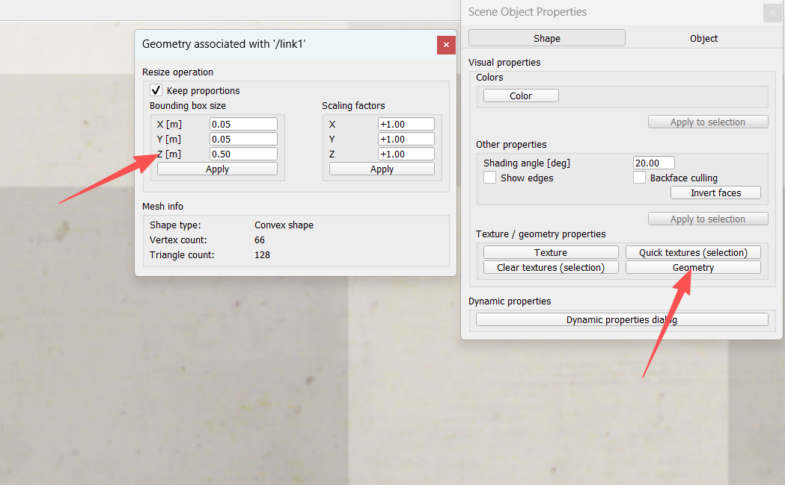
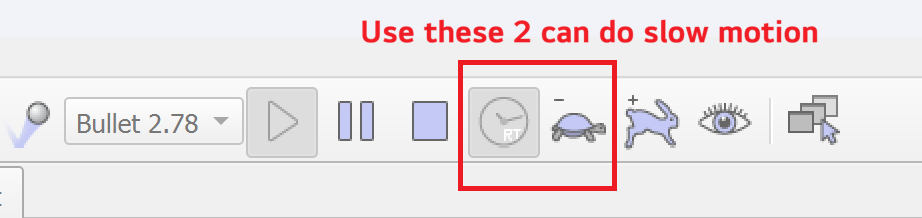

# Week 6: Inverse Kinematics Solving

---------------
#### :dizzy: **Date :** Feb 20
#### :alarm_clock: Finish Check Points and Submit sheet to obtain grade.

------------------
## 0. Scene File

- [ ] Download the  provided ``Asset/week6_IK_worksheet.ttt`` scene file.

- [ ] The length of three links are: **0.5 m, 1 m, 0.6 m**
  You can double click each link, In "Shape -> Geometry -> Bounding box size -> Z [m]" to view the length of each link

## 1. Analytic Inverse Kinematics

Firstly, let us using analytic IK to solve such IK problem:
* Desired Position: $(x, y, z) = (1.3, 0.6, 0)$
* Desired Oretation: $(row, pitch, yaw)= (0, 0, 40 deg)$

$$
{}^{0}_{3}T =
\begin{bmatrix}
C_{123} & -S_{123} & 0 & 0.5C_1 + C_{12} + 0.6C_{123} \\
S_{123} & \ \ C_{123} & 0 & 0.5S_1 + S_{12} + 0.6S_{123} \\
0 & 0 & 1 & 0 \\
0 & 0 & 0 & 1
\end{bmatrix}=
\begin{bmatrix}
\cos 40^\circ & -\sin 40^\circ & 0 & 1.3 \\
\sin 40^\circ & \ \cos 40^\circ & 0 & 0.6 \\
0 & 0 & 1 & 0 \\
0 & 0 & 0 & 1
\end{bmatrix}
$$

We have 3 equations to solve:

$$
\begin{aligned}
\theta_1 + \theta_2 + \theta_3 =40^\circ \\
0.5\cos\theta_1 + \cos(\theta_1+\theta_2) + 0.6\cos(\theta_1+\theta_2+\theta_3) = 1.3 \\
0.5\sin\theta_1 + \sin(\theta_1+\theta_2) + 0.6\sin(\theta_1+\theta_2+\theta_3) = 0.6
\end{aligned}
$$

Focus on the last 2 equations and plug in constant:

$$
\begin{aligned}
0.5\cos\theta_1 + \cos(\theta_1+\theta_2)  = 0.8404 \\
0.5\sin\theta_1 + \sin(\theta_1+\theta_2)  = 0.2144
\end{aligned}
$$

Perform square to both sides; and then add these 2 equations

$$
\begin{aligned}
0.5^2 + 1^2 +2\cdot 0.5\cdot 1 \cos\theta_2 = 0.8404^2 + 0.2144^2\\
1.25+ \cos\theta_2 = 0.7523
\end{aligned}
$$

This is 

$$
\begin{aligned}
\cos\theta_2 = -0.4977
\end{aligned}
$$

### :page_facing_up: Task 1 to complete:
- [ ] Continue the calculation, obtain the values for $\theta_1, \theta_2, \theta_3$. You should get 2 sets of values
- [ ] You can ask AI tools if feel difficulty in trigonometry
- [ ] Enter two sets of joint values in CoppeliaSim scene, verify if matches the requirement indicated in Section 0:  Desired Position: $(x, y, z) = (1.3, 0.6, 0)$; Desired Oretation: $(row, pitch, yaw)= (0, 0, 40 deg)$
- [ ] Report in Worksheet
1. Set 1 values for $(\theta_1, \theta_2, \theta_3)$; corresponding $(x, y, z; \alpha, \beta, \gamma)$ displayed in CoppeliaSim
2. Set 2 values for $(\theta_1, \theta_2, \theta_3)$; corresponding $(x, y, z; \alpha, \beta, \gamma)$ displayed in CoppeliaSim

------------------
## 2. Optimization-Based Inverse Kinematics

- [ ] Firstly, use ``jacobian_ik_3.py`` and ``Asset/week6_IK_lecture.ttt`` scene file.
- [ ] Play with these 2 files to understand the workflow
- [ ] For example, you can use a different desired pose set in Python,  such as `target = np.array([2, 0.8, 0.0, 0.0, 0.0, np.deg2rad(20.0)])`
- [ ] Run the python, you will get a set of velocities; then set the same set of velocities in lua to run the CoppeliaSim simulation.
- [ ] Once you are familiar with it, we will switch to ``Asset/week6_IK_worksheet.ttt``.  The Python code still works for it, you just need to change the length specification `L = {1: 0.8, 2: 1.0, 3: 1.0}`.
- [ ] Extra: If you want to obverse the slow motion in Simulation, you can click the "turtle" icon and then click "toggle real time mode"
      

### :page_facing_up: Task 2 to complete:
- [ ] Use ``Asset/week6_IK_worksheet.ttt``. The desired pose is given in the Worksheet.
- [ ] Use Python to compute a set of velocities; then use the same set of velocities in lua to run the CoppeliaSim simulation.
- [ ] Report in Worksheet
1. First 3 updates of vecloties ($\dot q=\dot\theta_1, \dot\theta_2, \dot\theta_3$)
2. Final 3 updates of velocities ($\dot q=\dot\theta_1, \dot\theta_2, \dot\theta_3$)
3. Final $(x, y, z, \alpha, \beta, \gamma)$ pose displayed in CoppeliaSim

Feel free to ask the instructor for questions.
