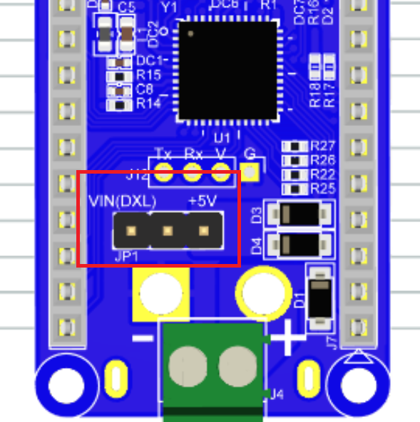
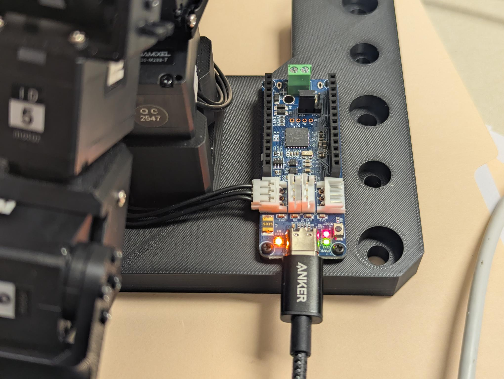
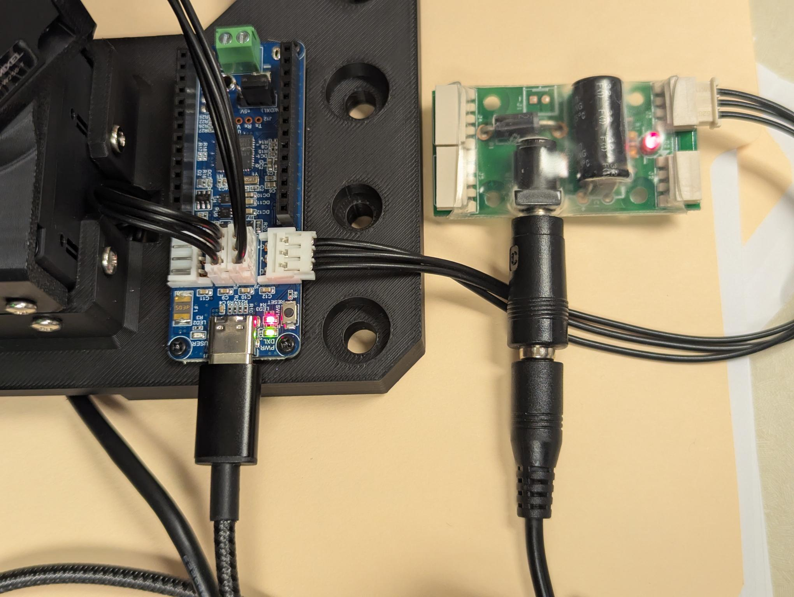

# Week 8: LeRobot First Trial

---------------
#### :dizzy: **Date :** March 6
#### :ballot_box_with_check: Please work collaboratively within your team. Also be generous to help other teams when possible.

--------

:large_blue_diamond: Form a Leader+Follower paring group. The number of students in each Leader+Follower group should be: 6, 6, 5, 5.

:large_blue_diamond: Each student should attempt the installation.

:large_orange_diamond: To get Worksheet checked, your Leader+Follower group should have half of machines working for the demo. 

:large_orange_diamond: Students arrive very late in class must finish installation to get full credit in Worksheet.

:fuelpump: An individual student demos "Task 6: Fully Integrated Teleoperation" on their own machine independently by March 27: 2 extra points toward final course grade

:fuelpump: An individual student demos "Task 4" and "Task 5", but not "Task 6" on their own machine independently by March 27: 1 extra point toward final course grade


------------------
## 1. LeRobot Installation

- [ ] Follow the install guide on the Robotis webpage https://ai.robotis.com/omx/setup_guide_lerobot.html 

	* Note, If you already installed Anaconda (used in ELE 251), you do not need to install Miniconda. Directly start from `Create a Virtual Environment` from that webapge.

	* In Anaconda, you can open "Anaconda Prompt" for command-line based installation.


## 2. Robot Connection

- [ ] The OpenRB Arduino board has a power source jumper. It must be set differently for Leader and Follower
      <br>https://emanual.robotis.com/docs/en/parts/controller/openrb-150/
  
	* If Leader: the VIN(DXL) pin should be left in the air. The cap covers the other 2 pins.

	* If Follower: the +5V pin should be left in the air. The cap covers the other 2 pins.


||
|---------------------|
|  | 

- [ ] Leader doesn't need extra power supply. It is directly powered by your computer USB.

|Leader |
|---------------------|
|  | 


- [ ] Follower needs an extra power supply. Use the Belker 36W power supply.
<br> Use the key  (provided in the Belker box) to turn it into 12 V.
<br> You need to connect it to an extra socket converter (provided in the Belker box).
<br> Then connect the power supply to the SMPS2Dynamixel green board.
<br> See this picture.

|Follower |
|---------------------|
|  | 

## 3. Verify Basic Installation 

- [ ] Use a USB cable to connect the robot to your computer. We will check with basic communication with lerobot.

In the virtual environment you created, run the Terminal command:

```bash
lerobot-find-port
```

You should see a port listed. To verify that this port corresponds to the robot: 
1. Disconnect the USB cable from the robot; 
2. Run the same command again: `lerobot-find-port`; 
3. Check whether the port disappears.

Here is my example print-out in Terminal in a Windows machine..

```bash
(lerobot) C:\Users\YC>(lerobot) C:\Users\Ramos>lerobot-find-port
Finding all available ports for the MotorsBus.
Ports before disconnecting: ['COM14']
Remove the USB cable from your MotorsBus and press Enter when done.
```

- [ ] After checking communication to the robot, we will now verify if Python can connect to the robot..
      <br>Make sure the Python  you are using comes from the virtual environment you just created. For example,

 	* if you prefer Anaconda, select the enviroment in Anaconda Navigator and then lanuch a Spyder Python IDE;
 	* if you prefer VSCode, make sure you choose the correct Python kernel within th IDE.


Check the basic Python package with this code:

```python
import lerobot
import pkgutil

print("LeRobot modules:")
print([m.name for m in pkgutil.iter_modules(lerobot.__path__)])
```


## 4. Verify Leader

- [ ] Connect Leader with you computer via USB. Try this code.
<br> You should modify the `PORT = ... ` based on your own computer.

```python
import time
from pprint import pprint

from lerobot.teleoperators.omx_leader.config_omx_leader import OmxLeaderConfig
from lerobot.teleoperators.omx_leader.omx_leader import OmxLeader

PORT = "COM14"

cfg = OmxLeaderConfig(port=PORT, id="omx_leader_arm")
leader = OmxLeader(cfg)

leader.connect()
print("Leader connected on", PORT)

# Show the leader outputs
print("action_features =", getattr(leader, "action_features", None))
print("\nPrinting leader.get_action()... Move the leader arm. Ctrl+C to stop.\n")

try:
    while True:
        a = leader.get_action()   
        print("keys:", list(a.keys()))
        pprint(a)
        time.sleep(1.0)
except KeyboardInterrupt:
    print("\nStopping...")
finally:
    leader.disconnect()
    print("Disconnected.")
```

Try to move each joint, see if the corresponding joint angle reading will change.
<br> Here is my example output:

```python
keys: ['shoulder_pan.pos', 'shoulder_lift.pos', 'elbow_flex.pos', 'wrist_flex.pos', 'wrist_roll.pos', 'gripper.pos']
{'elbow_flex.pos': 4.51770451770453,
 'gripper.pos': 59.87789987789988,
 'shoulder_lift.pos': -50.37851037851038,
 'shoulder_pan.pos': 2.5934065934065935,
 'wrist_flex.pos': 22.68620268620269,
 'wrist_roll.pos': 171.82417582417582}
```

## 5. Verify Follower

> [!CAUTION]
> Must place even fix your Follower on a large, safe surface without collision.
> 
> The Follower may move suddenly or unexpectedly. It will hit nearby objects or even fall off the table.


- [ ] Connect Follower with you computer via USB. And make sure it is properly powered.
<br> Try this code.
<br> You should modify the `PORT = ... ` based on your own computer.

- [ ] You can change `list(follower.bus.motors.keys())[0]` to others such as `list(follower.bus.motors.keys())[1]` to control a different motor. `[0]` is for the motor on base.
- [ ] If you get error message `[RxPacketError] The data value exceeds the limit value!`, just the value `- 15` to other.
<br> `- 15` means one direction by 15 degrees. for example change to `+ 15`

```python
import time
from lerobot.robots.omx_follower.config_omx_follower import OmxFollowerConfig
from lerobot.robots.omx_follower.omx_follower import OmxFollower

PORT = "COM12"

follower = OmxFollower(OmxFollowerConfig(port=PORT, id="omx_follower_arm"))
follower.connect()
print("Connected.")

# pick the first motor key (you can change which one)
k = list(follower.bus.motors.keys())[0]
print("Testing motor key:", k)

# read current position 
p0 = follower.bus.read("Present_Position", k)
print("Present_Position =", p0)

# enable torque (method name varies by branch)
if hasattr(follower.bus, "enable_torque"):
    follower.bus.enable_torque(k)

# command a small move then come back
try:
    follower.bus.write("Goal_Position", k, p0 - 15)
    time.sleep(3.0)
    follower.bus.write("Goal_Position", k, p0)
    time.sleep(3.0)
finally:
    # optional: disable torque
    if hasattr(follower.bus, "disable_torque"):
        follower.bus.disable_torque(k)
    follower.disconnect()
    print("Disconnected.")
```


## 6. Fully Integrated Teleoperation

- [ ] You can teleoperate the movement of the Leader to the Follower.
      https://huggingface.co/docs/lerobot/en/il_robots
- [ ] Connect both Leader and Follower to the same machine.
- [ ] Use this command-line in Terminal (either multiple-line or single-line, not sure which will work for your Terminal)
<br> Adjust the Ports to be the ones on your own computer.

- [ ] Multiple-line:
```shell
lerobot-teleoperate 
  --robot.type=omx_follower 
  --robot.port=COM12 
  --robot.id=omx_follower_arm 
  --teleop.type=omx_leader 
  --teleop.port=COM14 
  --teleop.id=omx_leader_arm
```

- [ ] Single-line:
```shell
lerobot-teleoperate --robot.type=omx_follower --robot.port=COM12 --robot.id=omx_follower_arm --teleop.type=omx_leader --teleop.port=COM14 --teleop.id=omx_leader_arm
```

Here is my example running:


I suggest you start reading online resource on LeRobot for better figuring out it.
