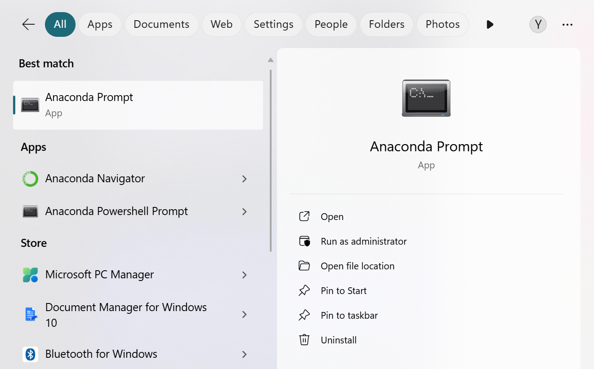
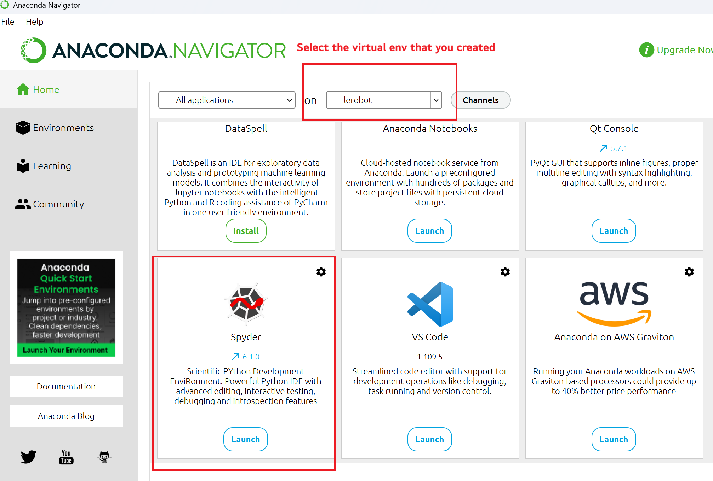

# Week 8_B: LeRobot First Trial

---------------
#### :dizzy: **Date :** March 5
#### :ballot_box_with_check: Please work collaboratively within your team. Also be generous to help other teams when possible.

------------------
## 1. LeRobot Installation

- [ ] Follow the install guide on the Robotis webpage https://ai.robotis.com/omx/setup_guide_lerobot.html 

	* Note, If you already installed Anaconda (used in ELE 251), you do not need to install Miniconda. Directly start from `Create a Virtual Environment` from that webapge.

	* In Anaconda, you can open "Anaconda Prompt" for command-line based installation.



## 2. Verify Installation 

- [ ] Use a USB cable to connect the robot to your computer. We will check with basic communication with lerobot.

In the virtual environment you created, run the command:

```bash
lerobot-find-port
```

You should see a port listed. To verify that this port corresponds to the robot: 
1. Disconnect the USB cable from the robot; 
2. Run the same command again: `lerobot-find-port`; 
3. Check whether the port disappears.

Here is my example print-out in Terminal in a Windows machine..

```bash
(lerobot) C:\Users\YC>(lerobot) C:\Users\Ramos>lerobot-find-port
Finding all available ports for the MotorsBus.
Ports before disconnecting: ['COM14']
Remove the USB cable from your MotorsBus and press Enter when done.
```

## 3. Verify Python Connection

- [ ] After checking communication to the robot, we will now verify if Python can connect to the robot..

- [ ] Make sure the Python  you are using comes from the virtual environment you just created. For example,

 	* if you prefer Anaconda, select the enviroment in Anaconda Navigator and then lanuch a Spyder Python IDE;
 	* if you prefer VSCode, make sure you choose the correct Python kernel within th IDE.


