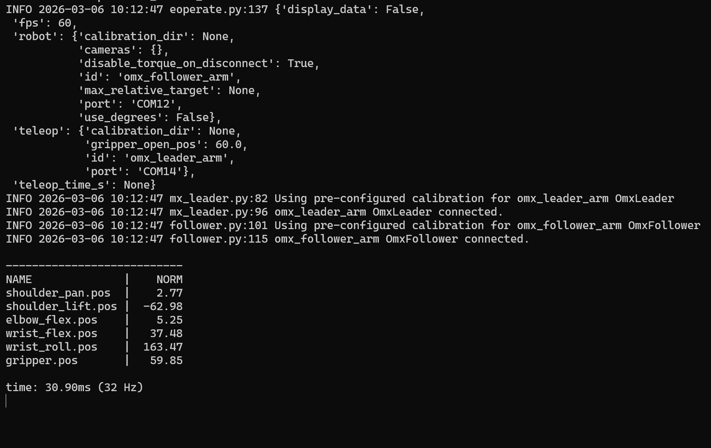

# Week 10: Motion Planning

---------------
#### :dizzy: **Date :** March 18


## 6. Fully Integrated Teleoperation

- [ ] You can teleoperate the movement of the Leader to the Follower.
      https://huggingface.co/docs/lerobot/en/il_robots
- [ ] Connect both Leader and Follower to the same machine.
- [ ] Use this command-line in Terminal (either multiple-line or single-line, not sure which will work for your Terminal)
<br> Adjust the Ports to be the ones on your own computer.

> [!CAUTION]
> Get ready for the sudden move of the Follower robot.


- [ ] Multiple-line:
```shell
lerobot-teleoperate 
  --robot.type=omx_follower 
  --robot.port=COM12 
  --robot.id=omx_follower_arm 
  --teleop.type=omx_leader 
  --teleop.port=COM14 
  --teleop.id=omx_leader_arm
```

- [ ] Single-line:
```shell
lerobot-teleoperate --robot.type=omx_follower --robot.port=COM12 --robot.id=omx_follower_arm --teleop.type=omx_leader --teleop.port=COM14 --teleop.id=omx_leader_arm
```

Here is my example running:



----

#### :wrench: *I suggest that you start reading online resources on LeRobot for better figuring it out.*

#### :wrench: If you want to try the Leader/Follower after class, you can place the boxes in the storage room of 3-217 (third floor). 
