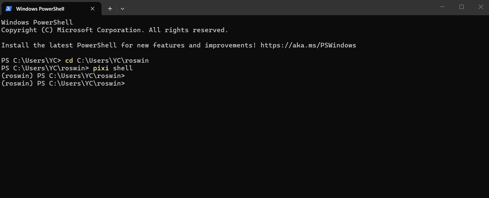
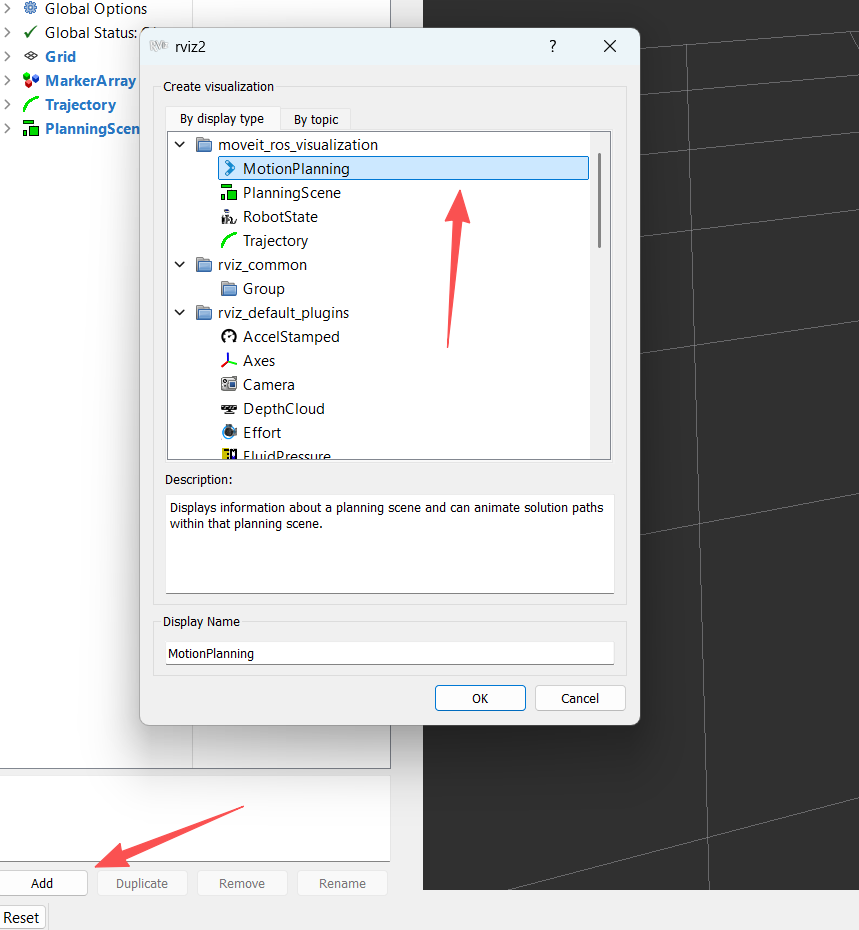
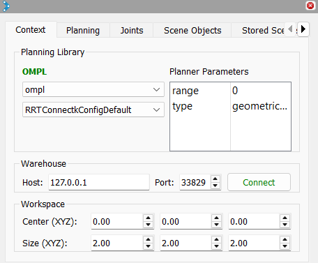

# Week 10: ROS 2 and Motion Planning

---------------
#### :dizzy: **Date :** March 18
#### :ballot_box_with_check: Please be generous to help others when possible.

## 1. ROS 2 Install

In this lab, we install ROS2 Humble + MoveIt using the Pixi-based environment provided by RoboStack.<br>
https://github.com/RoboStack/ros-humble <br>
This method does not require system-wide installation. It works inside a local environment.

The following steps listed here are for Windows, but the same idea also works for macOS with minor change.<br>
If you are in macOS, please check with ChatGPT on how to adapt the installation.

- [ ] step 1. pixi set-up
In Windows, open PowerShell, do
```bash
irm https://pixi.sh/install.ps1 | iex
```

- [ ] step 2. ROS env
Once done, restart Powershell<br>

create a ROS evnoiment in Powershell
```bash
pixi init roswin
cd roswin
```

Since this is not system-wide insllation, the full installation will only create a folder about 4 GB in your C drive.<br>
you can easily delete the whole folder after this semester.

|  |
|---------------------|
|  | 

- [ ] step 3. ROS set-up
Now, go to the C Drive -> User -> YourName -> roswin folder, open `pixi.toml` using text editor.<br>
Paste this into the `pixi.toml`:

```
[workspace]
name = "roswin"
channels = ["conda-forge", "robostack-staging"]
platforms = ["win-64"]

[dependencies]
ros-humble-desktop = "*"
ros-humble-moveit = "*"
ros-humble-moveit-resources-panda-moveit-config = "*"

ros-humble-controller-manager = "*"
ros-humble-ros2-control = "*"
ros-humble-ros2-controllers = "*"
ros-humble-joint-state-broadcaster = "*"
ros-humble-joint-trajectory-controller = "*"
```
This file sets all ROS packages you are going to install. <br>
If you want to extra ROS packages, you can edit this file later to install a new package.

Then in PowerShell, do
```bash
pixi install
```

Close Powershell, then reopen. Remove safety check
```bash
Set-ExecutionPolicy -Scope CurrentUser -ExecutionPolicy RemoteSigned
```


- [ ] step 4. ROS check
Open a new PowerShell, do
```bash
cd C:\Users\YourName\roswin
pixi shell
```



check basic ROS:
```bash
ros2 --help
```

check manipulator `moveit` packages:
```bash
ros2 pkg list | findstr moveit
```

----------
## 2. ROS 2 MoveIt and Motion Planning
The `MoveIt` is a commonly-used motion planning, manipulation, and kinematics framework in ROS.<br>
https://moveit.ai/

- [ ] Again, make sure you are in pixi-based ROS env.<br>
If not sure, restart your PowerShell,
```bash
cd C:\Users\YourName\roswin
pixi shell
```

Then start a MoveIt Demo in PowerShell:
```bash
ros2 launch moveit_resources_panda_moveit_config demo.launch.py
```
Your PowerShell should show no error, and you will get a new Visulization Window opened:


| Left: some part of PowerShell; Right: new Visulization Window|
|---------------------|
|  | 


- [ ] In the Window, the one buttom-left side, click "Add".<br>
Add the MotionPlanning.



- [ ] In the new section, click "Planning" tab, select "Planning Group" as "panda_arm".<br>
You will see 3 orthogonal circles rendered in the Simulation.<br>
You can directly drag and move this arm; Or you can go to "Joints" tab to set certain joints.

- [ ] In the new section, go to "Context" tab. Set as "ompl" and "RRTConectkConfigDefault".<br?
      Note other planners should also work. This is just a commonly-used one.
      


- [ ] Go back to the "Planning" tab, set "State State" as "ready", "Goal State" as "extended".<br>
Then click "Plannning", do you see the simulation result?

- [ ] You are free to change the settings, for example, drag the manipulator to somewhere else, set as "Goal State" as "Current". And do planning again.<br>
Note some self-defined positions may fail the planning.<br>
If failed, just try another position.


https://github.com/user-attachments/assets/86fbd5d0-0c40-4605-b562-719e92c48190


