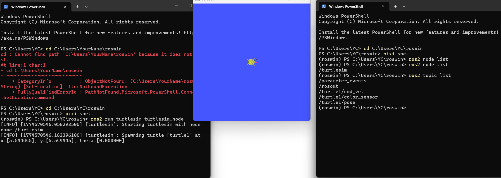
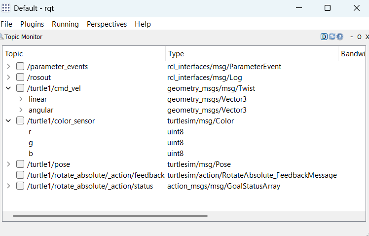
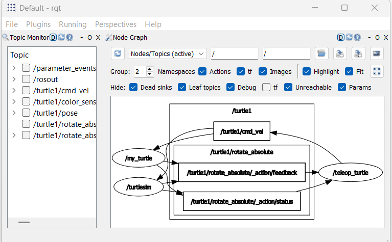

# Week 11: ROS 2 Essentials Part A – Turtlesim

---------------
#### :dizzy: **Date :** March 27
#### :ballot_box_with_check: Please be generous to help others when possible.

:large_blue_diamond: Every 3 persons: All Finish Part A

:large_blue_diamond: Every 3 persons: For Part B and Part C, the 3-person group must complete 4 parts in total. 

:large_blue_diamond: Can be distributed among in any way. Such as, Student 1 → Part B; Student 2 → Part B + Part C; Student 3 → Part C

## The Part A in a purely simulation setting.
#### This part basically follows the official tutorial, but no need to install extras.
#### https://docs.ros.org/en/humble/Tutorials/Beginner-CLI-Tools/Introducing-Turtlesim/Introducing-Turtlesim.html

------
### Step 1. Start Turtlesim
- [ ] To start, enter pixi-based ROS env in your PowerShell..<br>
Note, every newly-opened PowerShell window needs to do this first.

```bash
cd C:\Users\YourName\roswin
pixi shell
```

- [ ] In the first PowerShell window, do

```bash
ros2 run turtlesim turtlesim_node
```
You will get a new turtle window!

- [ ] In the second PowerShell window, try the following

```bash
ros2 node list
ros2 topic list
ros2 service list
ros2 action list
```

| Two PowerShell windows and a Turtlesim window |
|---------------------|
|  | 

- [ ] Next, open the thrid PowerShell window, do

```bash
rqt
```
In the opened window, go to "Plugins -> Topics -> Topic Monitor"

| |
|---------------------|
|  | 

----------
### Step 2. Understanding Nodes

Follow the steps in the official tutorial:<br>
https://docs.ros.org/en/humble/Tutorials/Beginner-CLI-Tools/Understanding-ROS2-Nodes/Understanding-ROS2-Nodes.html

Repeat their work.

----------
### Step 3. Understanding Topics

Follow the steps in the official tutorial:<br>
https://docs.ros.org/en/humble/Tutorials/Beginner-CLI-Tools/Understanding-ROS2-Topics/Understanding-ROS2-Topics.html

Repeat their work.

Note, `ros2 run rqt_graph rqt_graph` may not work in Windows. Instead, do this,

```bash
rqt
```

In the opened rqt windows, go to "Plugins -> Introspection -> Node Graph", you will get this tool.

| |
|---------------------|
|  | 
