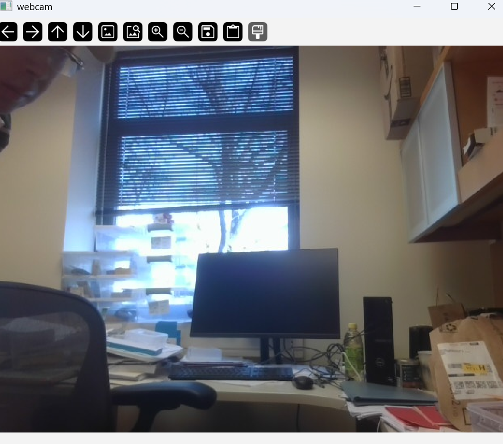

# Week 11: ROS 2 Essentials Part C – Camera Input

---------------
#### :dizzy: **Date :** March 27
#### :ballot_box_with_check: Please be generous to help others when possible.


## ROS 2 with Camera Feed
## Use your laptop webcam

----------
### Step 1. Install CV Dependencies

- [ ] To start, enter pixi-based ROS env in your PowerShell..<br>
Note, every newly-opened PowerShell window needs to do this first.

```bash
cd C:\Users\YourName\roswin
pixi shell
```

Then, do the installation in the PowerShell,

```bash
pixi add opencv
pixi add ros-humble-cv-bridge
pixi add ros-humble-sensor-msgs
pixi shell
```

----------
### Step 2. WebCam as ROS 2 Node

Create a Python code and place it under the roswin folder. Suppose it is named `webcam_set.py`

In the same PowerShell, run this Python file in command line.

```bash
python webcam_set.py
```
Python code:

```python
import cv2

import rclpy
from rclpy.node import Node
from sensor_msgs.msg import CompressedImage


class WebcamNode(Node):
    def __init__(self):
        super().__init__("webcam_node")

        self.cap = cv2.VideoCapture(0)
        self.pub = self.create_publisher(CompressedImage, "webcam/image/compressed", 10)
        self.timer = self.create_timer(0.1, self.timer_callback)

        self.get_logger().info("Webcam node started")

    def timer_callback(self):
        ret, frame = self.cap.read()
        if not ret:
            self.get_logger().warning("Failed to read webcam frame")
            return

        ok, encoded = cv2.imencode(".jpg", frame)
        if not ok:
            self.get_logger().warning("Failed to encode frame")
            return

        msg = CompressedImage()
        msg.format = "jpeg"
        msg.data = encoded.tobytes()
        self.pub.publish(msg)


def main():
    rclpy.init()
    node = WebcamNode()
    try:
        rclpy.spin(node)
    finally:
        node.cap.release()
        node.destroy_node()
        rclpy.shutdown()


if __name__ == "__main__":
    main()
```


----------
### Step 3. subscribe the ROS 2 WebCam topic

Create a Python code and place it under the roswin folder. Suppose it is named `webcam_view.py`

In the second PowerShell, run this Python file in command line.

```bash
python webcam_view.py
```

Python code:

```python
import cv2
import numpy as np

import rclpy
from rclpy.node import Node
from sensor_msgs.msg import CompressedImage


class Viewer(Node):

    def __init__(self):

        super().__init__("viewer")

        self.create_subscription(
            CompressedImage,
            "/webcam/image/compressed",
            self.callback,
            10,
        )

        print("Viewer started")

    def callback(self, msg):

        np_arr = np.frombuffer(msg.data, np.uint8)

        frame = cv2.imdecode(np_arr, cv2.IMREAD_COLOR)

        if frame is None:
            return

        cv2.imshow("webcam", frame)
        cv2.waitKey(1)


def main():

    rclpy.init()

    node = Viewer()

    rclpy.spin(node)

    rclpy.shutdown()


if __name__ == "__main__":
    main()
```


| |
|---------------------|
|  | 

Once running, open a third PowerShell, run `rqt`. Check the Node Graph.
